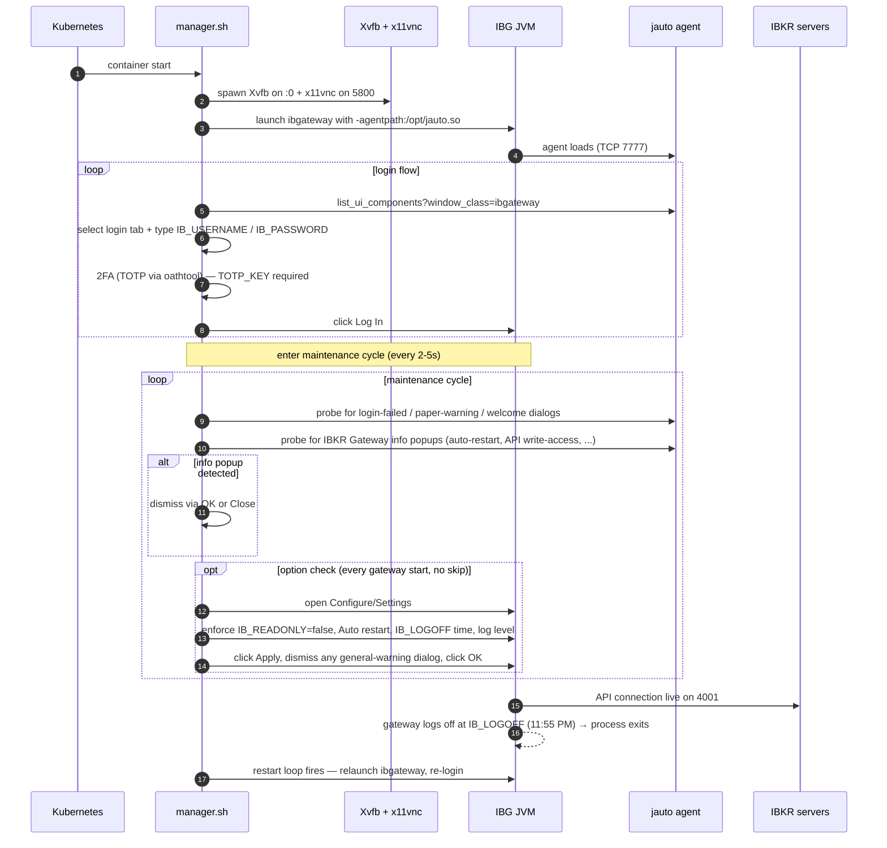

# ibga

Custom Interactive Brokers Gateway container image used as a sidecar by [zindari/lyra](https://github.com/zindari/lyra). Forked from [heshiming/ibga](https://github.com/heshiming/ibga) (GPL-3.0); diverged in support of zindari's automated trading infrastructure (TOTP via mounted secret, popup-handler hardening, always-re-check options on restart).

```
┌──────────────────────────────────────────┐
│  Lyra pod                                │
│  ┌────────────┐         ┌──────────────┐ │
│  │  lyra      │◀───────▶│  ib-gateway  │ │  TWS API  ┌─────────────┐
│  │  container │  TCP    │  (this image)│ │ ──────▶  │   IBKR      │
│  │            │  4001   │              │ │           │   servers   │
│  └────────────┘         │  • Xvfb      │ │           └─────────────┘
│                         │  • IBGW JVM  │ │
│                         │  • jauto     │ │  VNC (5800)
│                         │  • bash glue │ │  for operator inspection
│                         └──────────────┘ │
└──────────────────────────────────────────┘
```

The image installs IB Gateway at build time, then on container start runs a bash supervisor (`scripts/manager.sh`) that boots Xvfb + x11vnc + the JVM, drives the login flow with `xdotool`/`jauto`, dismisses transient popups, and restarts IB Gateway whenever the JVM exits (daily logoff, crash, …).

## Why a custom image

The upstream image is a great starting point but doesn't cover a few things zindari needs:

| Need | What we added |
|---|---|
| TOTP secret from K8s, not from the env | `TOTP_KEY` env (mounted from `ib-totp` `ExternalSecret`), consumed by `_run_ibg.sh` for the 2FA flow |
| Popup handler that catches IBGW info dialogs reliably | Wider matcher in `__maintenance_handle_general_warning` — scopes by `window_title=IBKR Gateway` (avoids conflation when Settings dialog is open) and runs every maintenance cycle |
| `Read-Only API` enforced on every restart, not just first boot | Removed the `skip_option_check2` one-shot guard so the option check re-runs on every gateway start (defends against `jts.ini` drift after any manual VNC toggle) |
| Auto-restart popup at 23:55 ET dismissal | Same widened popup handler |
| Larger virtual screen so option-check can reach the buttons | `xvfb-run` resolution bump |
| Build/push to GCP Artifact Registry on push to master | `.github/workflows/build.yml` + auto-bump in [zindari/gitops](https://github.com/zindari/gitops) |

## What it does on startup



## Configuration

Env vars consumed by the supervisor scripts:

| Env var | Purpose |
|---|---|
| `IB_USERNAME` / `IB_PASSWORD` | Account credentials, mounted from `ib-credentials` ExternalSecret |
| `IB_LOGINTYPE` | `Paper Trading` (default) or `Live Trading` (live overlay overrides) |
| `IB_LOGINTAB` | `IB API` (only mode we use) |
| `TOTP_KEY` | Time-based 2FA secret, mounted from `ib-totp` ExternalSecret |
| `IB_TIMEZONE` | `America/New_York` |
| `IB_LOGOFF` | When IBGW logs off, e.g. `11:55 PM` |
| `IB_PREFER_IBKEY` | When true, prefer IBKR Mobile authentication over SMS during 2FA |
| `IB_READONLY` | Currently a no-op env hint — kept for upstream compat. The actual enforcement is the option-check routine which reads this value at runtime. **The flag itself does not gate the API.** |
| `IB_APILOG` | API log mode (`data` for verbose, blank to disable) |
| `IB_LOGLEVEL` | Gateway log level — set to `Error` for live |
| `IBG_PORT` | Internal API port — `4001` (Live) / `4002` (Paper) |
| `IBGA_EXPORT_LOGS` | When `true`, daily log export to `IBG_SETTINGS_DIR/exported_logs` |

## Operator caveats

- **Daily restart at IB_LOGOFF time** — IBGW logs off at `IB_LOGOFF` (typically 11:55 PM ET) and the supervisor restarts the JVM. Lyra's `nextValidId` gate handles the order-id reset on the lyra side.
- **Read-Only API regression risk** — IBKR's GUI sometimes flips the `Read-Only API` checkbox back on (cause unknown — possibly a bundled-update default reset). The option-check routine fixes it on every gateway restart now (since lyra issue #148), but if the popup-handler ever fails to dismiss the auto-restart-considerations dialog, the JVM EDT can wedge until manual VNC intervention.
- **Operator portal login severs the API session** — When the operator logs into the IBKR web portal (e.g. to manually close a position), IBKR enforces single-session-per-account: the IBGW session is kicked, lyra logs `ibCode=1100`, and recovery happens within ~10–30s with `ibCode=1102`. This is by design, not an infrastructure incident.
- **VNC port** — exposed as 5800 (not 5900 — the FAQ default). For local inspection: `kubectl -n lyra-live port-forward deploy/lyra 5800:5800` and connect via noVNC at `http://localhost:5800/vnc.html`.

## Scripts overview

```
scripts/
├── manager.sh        # Top-level supervisor — orchestrates the whole lifecycle
├── _env.sh           # Path conventions, IBG_DIR / IBG_SETTINGS_DIR / DISPLAY
├── _utils.sh         # _info / _err logging helpers
├── _jauto.sh         # _call_jauto wrappers around the JVMTI agent's TCP API
├── _install_ibg.sh   # Build-time IB Gateway installer
├── _run_ibg.sh       # Runtime: login flow + maintenance cycle (the meat)
└── _run_xv.sh        # Spawns Xvfb + x11vnc + noVNC
```

`_run_ibg.sh` is where the option-check, popup handlers, login automation, and gateway-restart loop live. It's the most-edited file in the repo for that reason — most fixes go there.

## Image build

```bash
./build.sh               # local docker buildx build
```

Or via CI: `.github/workflows/build.yml` runs on push to `master`, builds via `docker build` (single arch — linux/amd64), and pushes to:

- `us-east1-docker.pkg.dev/zindari/docker/ibga:<short-sha>`
- `us-east1-docker.pkg.dev/zindari/docker/ibga:latest`

The `deploy` job then bumps the image tag in [zindari/gitops](https://github.com/zindari/gitops) for both lyra/paper and lyra/live overlays. ArgoCD picks up the change and rolls the lyra pod (which carries this sidecar).

## Local development

The image expects a real X11 stack and IBKR connectivity, so local single-image testing is awkward. The recommended path:

1. **Spin up a paper-only pod** in the cluster (`lyra-paper` namespace) on the new image — that's the cheapest end-to-end environment.
2. **VNC into the running container** via port-forward (5800 → noVNC) to verify popup handling and option-check behavior visually.
3. **Read the supervisor logs** via `kubectl logs deploy/lyra -c ib-gateway` for the bash-script audit trail (login progress, popup dismissals, option-check applies).

For pure script changes — `bash -n scripts/_run_ibg.sh` for syntax check, then deploy to paper.

## Related repos

- [zindari/lyra](https://github.com/zindari/lyra) — trade execution + risk; main consumer of this image
- [zindari/iorek](https://github.com/zindari/iorek) — signal generator (no broker I/O direct)
- [zindari/gitops](https://github.com/zindari/gitops) — kustomize manifests; auto-bumped by this repo's CI
- Upstream: [heshiming/ibga](https://github.com/heshiming/ibga)

## License

GPL-3.0 (per upstream). See `LICENSE`.
